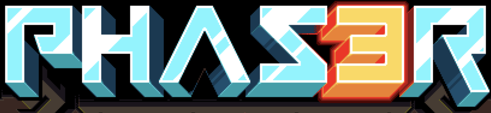
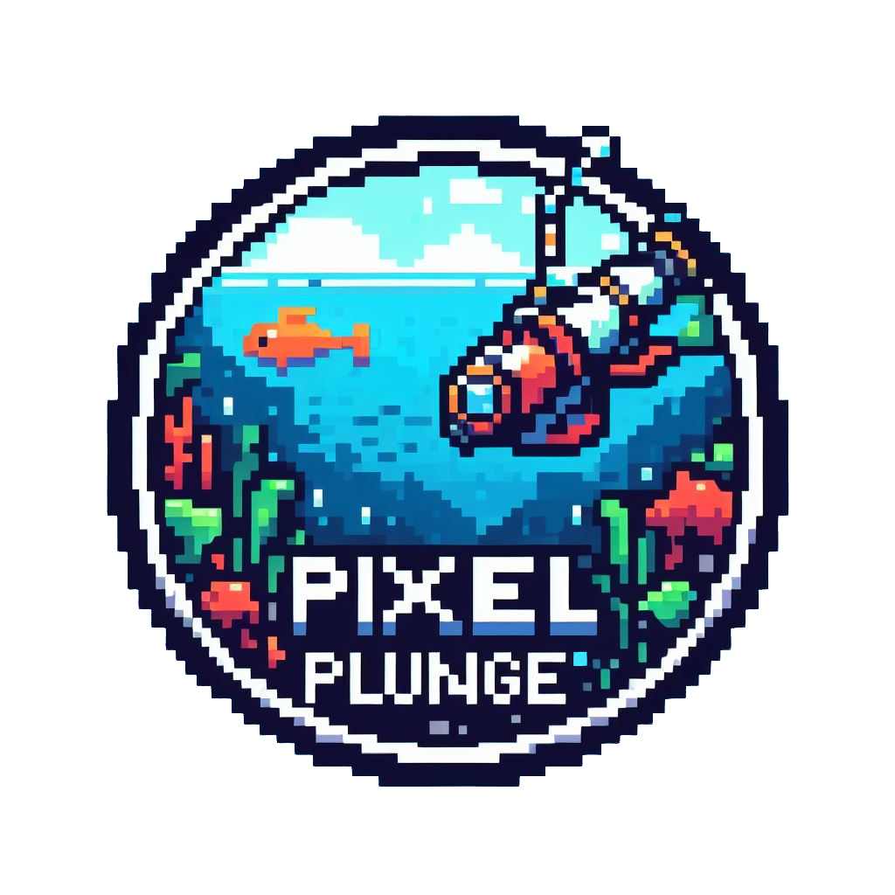

# Hi! I'm Jordan Eckford

I have recently completed a Software Development bootcamp with Northcoders and I am looking to land my first role.

Take a look at my porfolio website:
 

## <a href="https://jordaneckford.co.uk/"> jordaneckford.co.uk </a>

## Skills

   
  
  * 

- ![HTML5][htmlimg]
- ![CSS3][cssimg]
- [![Javascript][Javascriptimg]][Javscript-url]
- [![Vite][Viteimg]][Vite-url]
- [![Node][nodeimg]][node-url]
- [![React][React.js]][React-url]
- [![React-Router][ReactRouterimg]][ReactRouter-url]
- [![Netlify][Netlifyimg]][Netlify-url]
- [![Firebase][Firebaseimg]][Firebase-url]
- [![Express][expressimg]][express-url]
- [![Tailwind][tailwind]][tailwind-url]
- [![Jest][jest]][jest-url]

## Projects

### Pixel Plunge

- Pixel Plunge was my final group project on the Northcoders bootcamp. As a group of 5, we had 8 days to build this from scratch. It is a deep sea fishing game, where the aim is to catch as many fish as possible before the oxygen runs out.
- Made with Phaser 3 as the game engine, React, and Firebase
- GitHub Repo : https://github.com/sting-arrays/pixel-plunge
- Live App : https://pixel-plunge.netlify.app/

 

### NC News

- A full stack mock news application made by myself over 2 weeks during my Northcoders bootcamp.
- Backend made with PostgreSQL & Express. HTML, CSS, and React for the front end
- GitHub Repo's:
  - Front end: https://github.com/JordanEckford/nc-news-app
  - Back end: https://github.com/JordanEckford/nc-news
- Live app: https://jordanncnews.netlify.app/home

[React.js]: https://img.shields.io/badge/React-20232A?style=for-the-badge&logo=react&logoColor=61DAFB
[React-url]: https://reactjs.org/
[Javascriptimg]: https://img.shields.io/badge/JavaScript-F7DF1E?style=for-the-badge&logo=javascript&logoColor=black
[Javscript-url]: https://www.javascript.com
[ReactRouterimg]: https://img.shields.io/badge/React_Router-CA4245?style=for-the-badge&logo=react-router&logoColor=white
[ReactRouter-url]: https://reactrouter.com/en/main
[Netlifyimg]: https://img.shields.io/badge/Netlify-00C7B7?style=for-the-badge&logo=netlify&logoColor=white
[Netlify-url]: https://www.netlify.com
[Firebaseimg]: https://img.shields.io/badge/Firebase-039BE5?style=for-the-badge&logo=Firebase&logoColor=white
[Firebase-url]: https://firebase.google.com
[Viteimg]: https://img.shields.io/badge/vite-%23646CFF.svg?style=for-the-badge&logo=vite&logoColor=white
[Vite-url]: https://vitejs.dev
[expressimg]: https://img.shields.io/badge/Express.js-404D59?style=for-the-badge
[express-url]: https://expressjs.com/
[nodeimg]: https://img.shields.io/badge/Node.js-43853D?style=for-the-badge&logo=node.js&logoColor=white
[node-url]: https://nodejs.org/en/
[htmlimg]: https://img.shields.io/badge/HTML5-E34F26?style=for-the-badge&logo=html5&logoColor=white
[cssimg]: https://img.shields.io/badge/CSS-239120?&style=for-the-badge&logo=css3&logoColor=white
[tailwind]: https://img.shields.io/badge/Tailwind_CSS-38B2AC?style=for-the-badge&logo=tailwind-css&logoColor=white
[tailwind-url]: https://tailwindcss.com/
[jest]: https://img.shields.io/badge/Jest-323330?style=for-the-badge&logo=Jest&logoColor=white
[jest-url]: https://jestjs.io/

<!--
**JordanEckford/JordanEckford** is a ✨ _special_ ✨ repository because its `README.md` (this file) appears on your GitHub profile.

Here are some ideas to get you started:

- 🔭 I’m currently working on ...
- 🌱 I’m currently learning ...
- 👯 I’m looking to collaborate on ...
- 🤔 I’m looking for help with ...
- 💬 Ask me about ...
- 📫 How to reach me: ...
- 😄 Pronouns: ...
- ⚡ Fun fact: ...
-->
